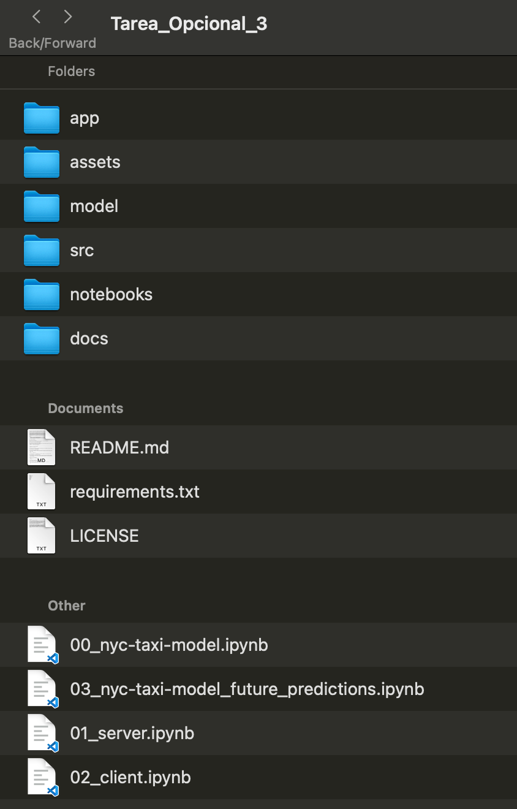

# Elaboración de una API (Fastapi), despliegue en la nube (Modal) y desarrollo de interfaz cliente (Streamlit)

## Descripción: Creación de una aplicación para predecir si un viaje en taxi en la ciudad de Nueva York generará una propina alta o baja para el conductor, basada en un conjunto de características del viaje. 

**Nota 1: Este Laboratorio está inspirado en la unidad 1 del curso [Introduction to Machine Learning in Production (DeepLearning.AI)](https://www.coursera.org/learn/introduction-to-machine-learning-in-production/home/welcome). También se apoya en código para generar el modelo disponible en [este repositorio de Shreya Shankar](https://github.com/shreyashankar/debugging-ml-talk) e implementar un flujo de trabajo usando Github Actions de la [Unidad 4 del curso mencionado anteriormente](https://github.com/jesussantana/DeepLearning.AI-Introduction-to-Machine-Learning-in-Production).**

**Nota 2: La sección #1 ha sido adaptada de las notas entregadas previamente por el profesor Alonso Astroza.**

## Índice
- [1. Requisitos de ambiente](#1-requisitos-de-ambiente)
- [2. Ejecutar la Aplicación Localmente](#2-ejecutar-la-aplicación-localmente)
- [3. Despliegue en un Entorno Serverless](#3-despliegue-en-un-entorno-serverless)
- [4. Uso de la Aplicación](#4-uso-de-la-aplicación)


## 1. Requisitos de ambiente
 
### 1.1 Pasos previos usando Conda
 
#### Prerequisito: Tener [conda](https://docs.conda.io/en/latest/) instalado en tu computador.
 
Vamos a usar Conda para construir un entorno virtual nuevo.
 
### 1.2 Creando el entorno virtual (Virtual Environment)
 
Asumiremos que tenemos instalado conda. El primer paso es crear un nuevo enviroment para desarrollar. Para crear uno usando Python 3.8 debemos ejecutar el siguiente comando:
 
```bash
conda create --name producto-datos-lab python=3.8
```
 
Luego debemos activarlo usando el comando:
 
```bash
conda activate producto-datos-lab
```
 
Todo el trabajo que realicemos con este código será en este entorno. Así que al trabajarcon estos archivos siempre tiene que estar activo el `producto-datos-lab`.
 
### 1.3 Instalando las dependencias usando PIP 
 
Antes de seguir, verifica que en el terminal de Anaconda estés dentro del directorio `producto-datos-lab`, el cual incluye el archivo `requirements.txt`. Este archivo enlista todas las dependencias necesarias y podemos usarlo para instalarlas todas:
 
```bash
pip install -r requirements.txt
```
 
Este comando puede demorar un rato dependiendo de la velocidad del computador y la de la conexión a Internet. 

### 1.4 Instalación de Git y clonación del repositorio

* En su computador vamos a crear una réplica del repositorio que contiene todos los archivos necesarios para poder ejecutar los programas; a parte de los archivos necesarios (programas, datos, modelos, instrucciones), también se replicará la estructura de carpetas que los contienen. Esta réplica la crearemos en un directorio (carpeta) que Ud. creará con ese propósito. 


#### Verificar si tiene instalado Git
* Verifíquelo ejecutando el siguiente comando: 

```bash
git -- version
```
* Si no está instalado, descárgelo e instálelo desde http://www.github.com.
* Cree una cuenta (si es que no tiene una)

#### Clonar el Repositorio desde GitHub

* En su computador local, cree una carpeta para este proyecto y diríjase a ella con el comando 'cd'.
* Ejecute el siguiente comando para clonar el repositorio 

```bash
git clone https://github.com/MatiasBunsterRaby/Tarea_3_final.git
```

* Esto descargará una copia completa del repositorio en su máquina local en una carpeta llamada 'Tarea_3_final'.

La estructura de archivos es la siguiente:



Para comenzar deben haber bajado todos los archivos a una carpeta y en el terminal de Anaconda llegar a ese directorio.

```
.
└── producto-datos-lab (este directorio)
    ├── model (acá irán nuestros modelos)
    ├── 00_nyc-taxi-model.ipynb
    ├── 01_server.ipynb
    ├── 02_client.ipynb
    └── requirements.txt (dependencias de Python)
```

### 2. Ejecutar la Aplicación Localmente

### 2.1 Iniciar el Backend con FastAPI

* El backend está definido en el archivo 'main.py' dentro de la carpeta 'app'.
* Para ejecutarlo se debe ejecutar el siguiente comando en el command prompt:

```bash
uvicorn app.main:app --reload
```

El backend se ejecutará en http://127.0.0.1:8000. Ingrese a su browser, abra una página nueva, y navegue a la dirección http://127.0.0.1:8000.

### 2.2 Iniciar la Interfaz de Usuario con Streamlit

* El frontend está definido en el archivo predecir_propina.py dentro de la carpeta app.

```bash
streamlit run app/predecir_propina.py
```
* La interfaz se abrirá en su navegador en http://localhost:8501. Ingrese a su browser, abra una página nueva, y pegue esta  dirección.


### 3. Despliegue en un Entorno Serverless

### 3.1 Configuración de Modal
#### Crear una cuenta en Modal
* En su browser vaya a https://modal.com/, cree una cuenta (si es que aún no lo ha hecho).

#### Instalar el cliente de Modal

* Estando en su ambiente creado con conda, ejecute el siguiente comando:

```bash
pip install modal
```
* Inicie sesión en Modal

```bash
modal token set <tu-token>
```
### 3.2 Desplegar la Apicación con FastAPI

#### Desplegar el backend con FastAPI

* Desde la raíz del proyecto ejecute el siguiente comando:

```bash
modal deploy app/modal_app.py
```

* Esto generará un URL proporcionado por Modal para acceder al backend.

#### Actualizar el Frontend para Usar el URL de Modal

* Edite el archivo app/predecir_propina.py y reemplaze la línea que contiene requests.post("https://matiasbunsterraby--nyc-taxi-tip-prediction-fastapi-app.modal.run/predict" con el nuevo URL generado.

#### Iniciar el Frontend

* Luego de actualizar el archivo 'predecir_propina.py' con el URL, ejecute el siguiente comando:

```bash
streamlit run app/predecir_propina.py
```

### 3.3 Acceso y uso

* Local: Acceda a http://localhost:8501 para utilizar la aplicación.
* Remoto: Acceda al URL proporcionado por Modal para interactuar con la aplicación en el entorno serverless

### 4. Uso de la Aplicación

* Ingresar Datos: Introduca los detalles del viaje en los campos que se muestran.
* Predecir Propina: Haga clic en el botón Predecir Propina para obtener una predicción.
* Resultados: La predicción se mostrará en una caja de color indicando si la predicción es que se recibirá una propina Alta o si se recibirá una propina Baja.

